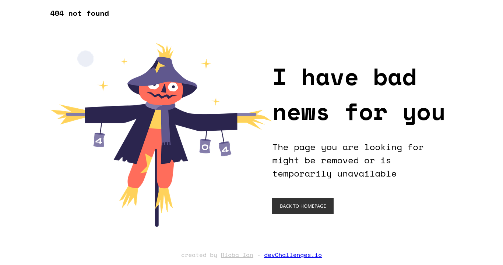
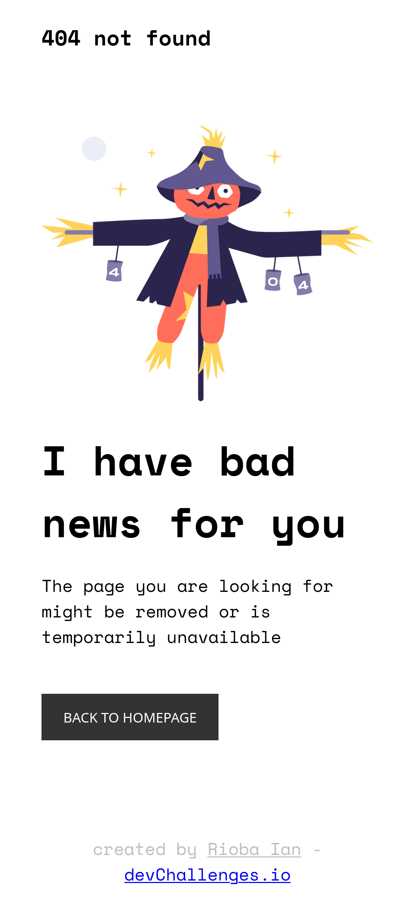

<!-- Please update value in the {}  -->

<h1 align="center">404 Error Page</h1>

   Solution for a challenge from  <a href="http://devchallenges.io" target="_blank">Devchallenges.io</a>.

  <h3>
    <a href="https://rioba-ian.github.io/404-not-found-master/">
      Demo
    </a>
     | 
    <a href="[https://{your-url-to-the-solution}](https://github.com/Rioba-Ian/404-not-found-master)">
      Solution
    </a>
     | 
    <a href="https://devchallenges.io/challenges/wBunSb7FPrIepJZAg0sY">
      Challenge
    </a>
  </h3>

<!-- TABLE OF CONTENTS -->

## Table of Contents

- [Table of Contents](#table-of-contents)
- [Overview](#overview)
  - [Built With](#built-with)
- [Features](#features)
- [Acknowledgements](#acknowledgements)
- [Contact](#contact)

<!-- OVERVIEW -->

## Overview
The desktop view

The mobile view

Some of css new features I applied here are the clamp in font sizes and the min() for width and maxwidth.

### Built With

<!-- This section should list any major frameworks that you built your project using. Here are a few examples.-->

- HTML and CSS

## Features

<!-- List the features of your application or follow the template. Don't share the figma file here :) -->

This application/site was created as a submission to a [DevChallenges](https://devchallenges.io/challenges) challenge. The [challenge](https://devchallenges.io/challenges/wBunSb7FPrIepJZAg0sY) was to build an application to complete the given user stories.

## Acknowledgements

<!-- This section should list any articles or add-ons/plugins that helps you to complete the project. This is optional but it will help you in the future. For exmpale -->

- [Steps to replicate a design with only HTML and CSS](https://devchallenges-blogs.web.app/how-to-replicate-design/)
- [Marked - a markdown parser](https://github.com/chjj/marked)

## Contact

- Website [Rioba](https://ian-rioba-portfolio.netlify.app/)
- GitHub [@Rioba Ian](https://github.com/Rioba-Ian)
- Twitter [@Rioba](https://twitter.com/rioba_riri)
